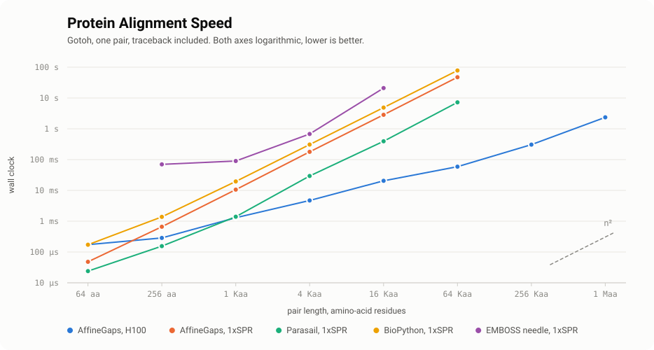
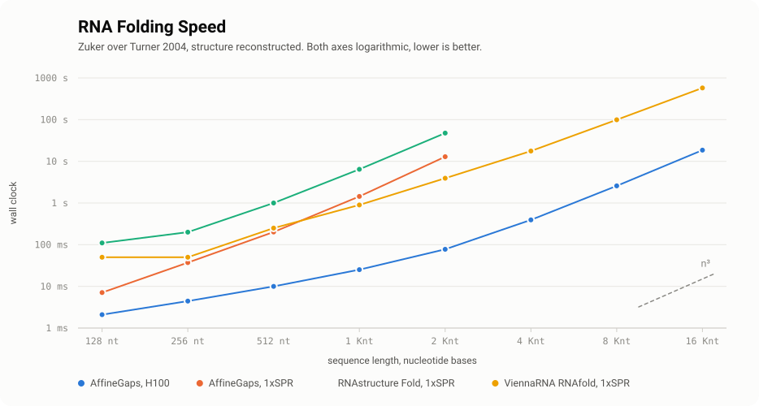
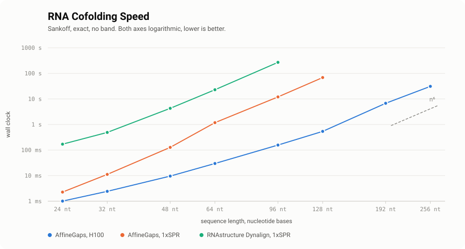

# AffineGaps


__AffineGaps__ collects __less-wrong__ implementations of the classical biosequence dynamic programs, exact and with traceback, on the GPU.
It covers Osamu Gotoh's 1982 affine gap penalty [paper](https://doc.aporc.org/attach/Course001Papers/gotoh1982.pdf) for the Needleman-Wunsch and Smith-Waterman algorithms - with several algorithmic corrections to the original paper, and David Sankoff's 1985 simultaneous alignment and folding of RNA.
Unlike potentially faster algorithms in [StringZilla](https://github.com/ashvardanian/StringZilla), beyond scoring — AffineGaps also reconstructs the alignment strings, __also on the GPU__.
Gotoh reconstructs in __linear memory__; Sankoff provably cannot, and the reason is worth reading below.
A NumPy reference implementation ships beside every Mojo kernel and serves as the parity oracle.

- __`alignment`__ — two sequences lined up, so equivalent letters sit above each other and dashes mark what one has and the other lacks.
  A ten-letter deletion is one mutation and not ten, so a gap is priced by run — one opening charge plus a cheaper per-letter extension, which is Gotoh's affine gap cost.
  Tracing the path back would normally cost a whole $O(nm)$ matrix, so Hirschberg's recursive splitting halves the problem, solves both halves, and joins them.
  $O(nm)$ time and $O(\min(n, m))$ memory, global end-to-end or local best-window, returning the two sequences with their gaps written in and the score.

- __`folding`__ — one RNA strand, which sticks to itself where A meets U and G meets C, snapping back into stems and loops.
  Zuker's recurrence tries every way the strand can pair with itself and keeps the most stable, pricing each stem and loop from the Turner tables of measured energies.
  The answer is a dot-bracket string, one character per base, where a matched `(` and `)` are two bases paired together and a `.` is a base left alone.
  $O(n^3)$ time and $O(n^2)$ memory, returning that string and its free energy in kilocalories per mole.

- __`cofolding`__ — the same RNA from two species, aligned and folded in one sweep rather than aligned first and folded second.
  A pair counts only where both strands can form it, so two letters changing together while the pair survives is evidence of a structure evolution is protecting, and that covariation is what Sankoff's recurrence scores.
  The shared structure is one dot-bracket string over the alignment columns rather than over either sequence, describing the pairing both sequences agree on.
  $O(n^3 m^3)$ time and $O(n^2 m^2)$ memory, returning the aligned pair, that string, and the score.

## Less Wrong

As reported in the "Are all global alignment algorithms and implementations correct?" [paper](https://www.biorxiv.org/content/10.1101/031500v1.full.pdf) by Tomas Flouri, Kassian Kobert, Torbjørn Rognes, and Alexandros Stamatakis:

> In 1982 Gotoh presented an improved algorithm with lower time complexity.
> Gotoh’s algorithm is frequently cited...
> While implementing the algorithm, we discovered two mathematical mistakes in Gotoh’s paper that induce sub-optimal sequence alignments.
> First, there are minor indexing mistakes in the dynamic programming algorithm which become apparent immediately when implementing the procedure.
> Hence, we report on these for the sake of completeness.
> Second, there is a more profound problem with the dynamic programming matrix initialization.
> This initialization issue can easily be missed and find its way into actual implementations.
> This error is also present in standard text books.
> Namely, the widely used books by Gusfield and Waterman.
> To obtain an initial estimate of the extent to which this error has been propagated, we scrutinized freely available undergraduate lecture slides.
> We found that 8 out of 31 lecture slides contained the mistake, while 16 out of 31 simply omit parts of the initialization, thus giving an incomplete description of the algorithm.
> Finally, by inspecting ten source codes and running respective tests, we found that five implementations were incorrect.

During my exploration of existing implementations, I've noticed several bugs:

- several libraries initialize the header row/columns of penalty matrices with ±∞, causing overflows on the first iteration.
- initialize matrices to zeros, ignoring the first gap opening cost.
- combining opening and expansion costs where only the opening cost should be applied.
- even the most correct `needle` from EMBOSS uses `float` representation, which would obviously be numerically unstable on very long sequences.

## Benchmarks

Throughput first, against the same kernels compiled for one CPU core, with third-party tools where one implements the same recurrence.
Every cell is __wall time · cell-update rate__, and a cell update is one evaluation of the innermost recurrence rather than one entry of the table — `n * m` for alignment, an interior-loop triangle plus two bifurcation scans per span for folding, one bifurcation per window pair for cofolding.
Counting the work rather than the storage is what lets the same unit describe all three: a rate over table entries would fall with length by construction for the two folding recurrences, which spend $O(n)$ and $O(n^2)$ work per entry.

A dash is a run that did not finish inside five minutes or whose table exceeded a 24 GiB budget.
Lengths climb by four where time is quadratic, by two where it is cubic and by half where it is sextic, so each ladder spans a comparable range of wall clock rather than a comparable range of length.
Best of three below 4096 and a single run above, every answer checked against the serial sweep, and the third-party rows are command-line invocations, so their sub-100 ms cells are mostly process startup.

### Protein Alignment Speed

<picture>
  <source media="(prefers-color-scheme: dark)" srcset="assets/alignment-dark.svg">
  
</picture>

| Variant           |               64 aa |              256 aa |              1 Kaa |               4 Kaa |               16 Kaa |               64 Kaa |            256 Kaa |                1 Maa |
| :---------------- | ------------------: | ------------------: | -----------------: | ------------------: | -------------------: | -------------------: | -----------------: | -------------------: |
| AffineGaps, H100  |   173 µs · 24 MCUPS |  287 µs · 229 MCUPS | 1.3 ms · 790 MCUPS | 4.7 ms · 3.58 GCUPS | 20.5 ms · 13.1 GCUPS | 59.0 ms · 72.8 GCUPS | 307 ms · 224 GCUPS | 2.36 s · 467 GCUPS ¹ |
| AffineGaps, 1xSPR |    48 µs · 86 MCUPS |   660 µs · 99 MCUPS | 10.6 ms · 99 MCUPS |   179 ms · 94 MCUPS |    2.85 s · 94 MCUPS |    47.3 s · 91 MCUPS |                  — |                    — |
| Parasail, 1xSPR   |   24 µs · 171 MCUPS |  155 µs · 423 MCUPS | 1.4 ms · 728 MCUPS | 29.4 ms · 571 MCUPS |   394 ms · 682 MCUPS | 7.22 s · 595 MCUPS ² |                  — |                    — |
| EMBOSS, 1xSPR     | 110 ms · 37 KCUPS ³ | 70.0 ms · 936 KCUPS | 90.0 ms · 12 MCUPS |   680 ms · 25 MCUPS |  21.0 s · 13 MCUPS ² |                    — |                  — |                    — |

> Measured 23 August 2026, random protein pairs, BLOSUM62 scaled fivefold.
> Columns are pair lengths in amino-acid "aa" residues.
> No row is adaptive, so none depends on how similar the inputs are.
> ¹ Still climbing; the card is not saturated.
> ² Stops on memory: a stored traceback matrix costs bytes per cell.
> ³ Dominated by process startup, as every command-line cell under a tenth of a second is.

### RNA Folding Speed

<picture>
  <source media="(prefers-color-scheme: dark)" srcset="assets/folding-dark.svg">
  
</picture>

| Variant             |              128 nt |              256 nt |               512 nt |                1 Knt |                2 Knt |               4 Knt |               8 Knt |                 16 Knt |
| :------------------ | ------------------: | ------------------: | -------------------: | -------------------: | -------------------: | ------------------: | ------------------: | ---------------------: |
| AffineGaps, H100    | 2.1 ms · 2.27 GCUPS | 4.4 ms · 4.95 GCUPS | 10.0 ms · 11.0 GCUPS | 25.2 ms · 24.6 GCUPS | 77.7 ms · 50.2 GCUPS | 393 ms · 68.9 GCUPS | 2.58 s · 77.3 GCUPS |    18.6 s · 82.4 GCUPS |
| AffineGaps, 1xSPR   |  7.1 ms · 675 MCUPS | 37.2 ms · 589 MCUPS |   202 ms · 545 MCUPS |   1.44 s · 430 MCUPS |   12.9 s · 303 MCUPS |                   — |                   — |                      — |
| ViennaRNA, 1xSPR    |  50.0 ms · 96 MCUPS | 50.0 ms · 438 MCUPS |   250 ms · 440 MCUPS |   900 ms · 687 MCUPS |   3.93 s · 993 MCUPS | 17.7 s · 1.53 GCUPS | 99.6 s · 2.01 GCUPS | 9.6 min · 2.65 GCUPS ¹ |
| RNAstructure, 1xSPR |   110 ms · 44 MCUPS |  200 ms · 110 MCUPS |   1.00 s · 110 MCUPS |    6.44 s · 96 MCUPS |    47.6 s · 82 MCUPS |                   — |                   — |                      — |

> Measured 23 August 2026, random RNA, Turner 2004 parameters.
> Columns are sequence lengths in nucleotide "nt" bases.
> ¹ Held in 1.45 GiB; time binds, not memory.

### RNA Cofolding Speed

<picture>
  <source media="(prefers-color-scheme: dark)" srcset="assets/cofolding-dark.svg">
  
</picture>

| Variant             |               24 nt |                32 nt |                48 nt |                64 nt |                96 nt |                128 nt |              192 nt |               256 nt |
| :------------------ | ------------------: | -------------------: | -------------------: | -------------------: | -------------------: | --------------------: | ------------------: | -------------------: |
| AffineGaps, H100    | 1.1 ms · 5.03 GCUPS |  2.4 ms · 12.4 GCUPS | 19.8 ms · 17.1 GCUPS | 67.1 ms · 28.5 GCUPS |  414 ms · 52.6 GCUPS | 2.02 s · 60.3 GCUPS ¹ | 30.8 s · 45.2 GCUPS | 3.7 min · 35.6 GCUPS |
| AffineGaps, 1xSPR   | 4.4 ms · 1.19 GCUPS | 23.7 ms · 1.26 GCUPS |   407 ms · 835 MCUPS |   3.17 s · 602 MCUPS |   41.5 s · 524 MCUPS |                     — |                   — |                    — |
| RNAstructure, 1xSPR |   170 ms · 31 MCUPS |    490 ms · 61 MCUPS |    4.30 s · 79 MCUPS |    22.9 s · 83 MCUPS | 4.5 min · 81 MCUPS ² |                     — |                   — |                    — |

> Measured 23 August 2026, random RNA, covariance scoring.
> Columns are sequence lengths in nucleotide "nt" bases.
> `dynalign` ran with `imaxseparation = n`, which switches its banding off, and scores Turner energies instead — so compare the clock, not the rate.
> ¹ Rate peaks here; past L2 the bifurcation scan scatters against HBM.
> ² Where one core stops being practical.

### Alignment Speed Against WFA2

One __NVIDIA H100 80GB HBM3__ against __WFA2__ on one CPU core, both reconstructing the alignment rather than only scoring it.
DNA pairs at 10 percent divergence, the range long-read work lives in, with every score checked to agree exactly before timing.

```
                   wfa2 faster  ←│→  affinegaps faster
    1 kbp                       ▍│                          1.1x
   10 kbp                        │████▋                     2.2x
  100 kbp                        │█████████████████        17.2x
  300 kbp                        │██████████████████████   39.8x
    1 Mbp                        │██████████████████████  out of memory
```

The last row is not a timing.
WFA2 reconstructs exactly, and its traceback grows with the square of the alignment score, so a megabase pair at this divergence exhausts tens of gigabytes before finishing, where the linear-space recursion holds a few frontiers and finishes in seconds.

That same growth is what decides every other row, and it makes the crossover a property of the data rather than of the sequence length.
On a 30 kilobase pair, mutated harder each row:

```
                   wfa2 faster  ←│→  affinegaps faster
     0.1%     ███████████████████│                         55.5x
       1%            ███████████▊│                         12.0x
       5%                        │█▊                        1.5x
      10%                        │███████▌                  5.0x
      25%                        │███████████████▊         28.3x
      50%                        │████████████████████▋    79.7x
    99.9%                        │██████████████████████  104.6x
```

A full sweep never notices how different the sequences are, so reach for WFA2 on near-identical inputs and for this on divergent or very long ones.

Linear memory is meant literally, and it is what makes the long end reachable at all.
A four-megabase pair reconstructs inside a gigabyte of device memory, and doubling the pair grows that by a third rather than by four, so an 80-gigabyte card has room for sequences far longer than anything measured here.

### Folding Accuracy Against RNAstructure

Accuracy is reported on __ArchiveII__, the Mathews lab set of 3,975 known structures across ten families that is the standard benchmark for thermodynamic folders.
It plays the role here that BLOSUM62 and Biopython play on the protein side: an external reference this project is measured against rather than tuned on.
The set is not vendored; the harness reads it from `data/archive-ii`.

Every predicted pair is checked against the structure that was actually measured for that molecule, so both columns are contestants and neither one is the answer key.
F1 runs from zero to one and rewards finding real pairs while punishing invented ones, so no folder can win by guessing generously.
The last column subtracts the two scores sequence by sequence and averages, so a negative number means `Fold` won and the ± is how far that verdict would move on another sample of the same size.

| Family         | Role                      | Sequences | AffineGaps F1 | RNAstructure F1 |     ΔF1 ± s.e. |
| :------------- | :------------------------ | --------: | ------------: | --------------: | -------------: |
| tRNA           | delivers amino acids      |       120 |         0.571 |           0.677 | −0.107 ± 0.028 |
| 5S rRNA        | scaffolds the ribosome    |       120 |         0.615 |           0.610 | +0.005 ± 0.024 |
| SRP RNA        | targets new proteins      |       120 |         0.626 |           0.630 | −0.003 ± 0.019 |
| RNase P        | trims tRNA precursors     |       120 |         0.461 |           0.513 | −0.053 ± 0.013 |
| tmRNA          | rescues stalled ribosomes |       120 |         0.379 |           0.390 | −0.011 ± 0.012 |
| Group I intron | splices itself out        |        38 |         0.471 |           0.496 | −0.025 ± 0.027 |

__Only tRNA and RNase P differ by more than their uncertainty.__
On the other four families the reduced model is statistically indistinguishable from the complete one.
`Fold`'s own numbers sit where the literature puts the Turner model, so the comparison is calibrated rather than flattering.

## Installation

There is no package-registry release; the repository is the distribution.
Where Mojo ships a toolchain — Linux on x86-64 or ARM, and macOS on Apple silicon — the compiled kernels are built during the install and travel with the package.
Everywhere else you get the NumPy reference alone, from the same command.

### As a Python Package

```bash
uv pip install git+https://github.com/unum-science/AffineGaps.git
uv pip install 'affinegaps[numba] @ git+https://github.com/unum-science/AffineGaps.git'
```

Pin a tag or a commit when the build has to be reproducible:

```bash
uv pip install 'affinegaps @ git+https://github.com/unum-science/AffineGaps.git@v0.2.5'
```

Two optional extras, neither of them required: `numba` accelerates the NumPy reference, and `color` paints the command-line output.

### As a Command-Line Tool

`uv tool install` puts `affinegaps` on your path without touching the current environment:

```bash
uv tool install git+https://github.com/unum-science/AffineGaps.git
```

The same tool is also built natively from a checkout, with no Python involved at run time:

```bash
git clone https://github.com/unum-science/AffineGaps.git && cd AffineGaps
pixi run install      # `affinegaps` on the PATH, compiled kernels included
pixi run build-cli    # or build/affinegaps, a standalone binary
```

Both accept the same verbs and print the same thing, so install whichever suits you rather than both.
To run it once without installing anything, `uvx` fetches, builds and runs it in a throwaway environment:

```bash
uvx --from git+https://github.com/unum-science/AffineGaps.git affinegaps align GATTACA GACTATA
```

### As a Pixi Dependency

A downstream [pixi](https://pixi.sh) project takes the same git dependency, pinned in `pixi.lock` beside everything else:

```bash
pixi add --pypi 'affinegaps @ git+https://github.com/unum-science/AffineGaps.git'
```

### Requirements for the GPU

The compiled kernels run on the CPU anywhere Mojo builds them.
Reaching the GPU additionally needs an NVIDIA device with driver 580 or newer, and `available("mojo", "gpu")` reports whether this machine has one — it tries a real alignment rather than assuming.

## Using the Library

### Backends and Devices

Every entry point runs elsewhere by naming where the work goes.
Two axes: `backend` chooses which implementation, `device` chooses which hardware.
Naming neither picks the fastest the machine offers.

```python
needleman_wunsch_gotoh_alignment(first, second)                     # fastest available
needleman_wunsch_gotoh_alignment(first, second, backend="python")   # the reference
zuker_fold(sequence, backend="mojo")                                # compiled, host
sankoff_cofold(first, second, backend="mojo", device="gpu")
```

Unspecified adapts; specified is honoured or refused.
Asking for a backend that is not built raises rather than quietly running something else, so a measurement can never report the GPU while timing the reference.

There is no knob for how the traceback stores its state.
Below a size threshold it keeps a decision per cell, above it recurses in linear space, and the two produce identical output — so the choice is cost, never correctness.

### Aligning Two Sequences

To obtain the alignment of two sequences, use the `needleman_wunsch_gotoh_alignment` function.

```python
from affinegaps import needleman_wunsch_gotoh_alignment

insulin = "GIVEQCCTSICSLYQLENYCN"
glucagon = "HSQGTFTSDYSKYLDSRAEQDFV"
aligned_insulin, aligned_glucagon, score = needleman_wunsch_gotoh_alignment(insulin, glucagon)

print("Alignment 1:", aligned_insulin)  # ---GIVEQCCTSICSLYQLENYCN----
print("Alignment 2:", aligned_glucagon) # HSQGTF----TSDYSKY-LDSRAEQDFV
print("Score:", score)                  # 22
```

If you only need the alignment score, `needleman_wunsch_gotoh_score` uses less memory and works faster.
Batches are where the device earns its keep, one thread block per pair:

```python
from affinegaps import needleman_wunsch_gotoh_alignments, available

if available("mojo", "gpu"):
    results = needleman_wunsch_gotoh_alignments(firsts, seconds, backend="mojo", device="gpu")
```

By default a BLOSUM62 substitution matrix scaled by five is used.
Costs come in two records: the gap model, and either a uniform pair of scores or a table.

```python
import numpy as np
from affinegaps import AffineGapCosts, UniformSubstitutionCosts, TabulatedSubstitutionCosts

aligned_insulin, aligned_glucagon, score = needleman_wunsch_gotoh_alignment(
    insulin, glucagon,
    substitution=UniformSubstitutionCosts(match=1, mismatch=-1),
    gaps=AffineGapCosts(open=-2, extend=-1),
)

alphabet = "ARNDCQEGHILKMFPSTWYVBZX"
substitutions = np.full((len(alphabet), len(alphabet)), -1, dtype=np.int8)
np.fill_diagonal(substitutions, 1)

aligned_insulin, aligned_glucagon, score = needleman_wunsch_gotoh_alignment(
    insulin, glucagon,
    substitution=TabulatedSubstitutionCosts(alphabet, substitutions),
    gaps=AffineGapCosts(open=-2, extend=-1),
)
```

A uniform cost carries its match and its mismatch together, and a table carries its matrix and the alphabet indexing it, so neither can be half-specified and the two cannot be combined.
That is similar to the following usage example of BioPython:

```python
from Bio import Align
from Bio.Align import substitution_matrices

aligner = Align.PairwiseAligner(mode="global")
aligner.substitution_matrix = substitution_matrices.load("BLOSUM62")
aligner.open_gap_score = open_gap_score
aligner.extend_gap_score = extend_gap_score
```

### Folding One Sequence

Zuker's recurrence over the Turner nearest-neighbour model, exact, with the structure reconstructed rather than just its energy.

```python
from affinegaps import zuker_fold

structure, energy = zuker_fold("GGGGCAAAAGCCCC")

print(structure)  # (((((....)))))
print(energy)     # -9.2, kilocalories per mole
```

The recurrence works in integer decikilocalories, so a sequence always folds to the same answer rather than depending on floating-point association order.

The parameters in `turner.py` are the published Turner 2004 constants.
The kernels use __stacking, loop initiation by size, terminal mismatches on hairpins and internal loops, the tabulated tri-, tetra- and hexaloops, dangling ends, Ninio's asymmetry correction, the linear multiloop rule and the terminal AU penalty__.

They do __not__ use coaxial stacking, or the special tables for one-by-one, two-by-one and two-by-two internal loops.
Dangles are charged to both neighbours of every helix placed in an exterior loop or a multiloop, which needs no extra states in the recurrence but slightly over-counts where two helices abut.

So this remains __an exact implementation of a documented model__ rather than a drop-in replacement for a complete Turner folder.
Every number traces to a table you can read, and the remaining omissions — coaxial stacking above all — are additive refinements that fit behind the same interface.

### Aligning and Folding Together

Sankoff's recurrence aligns two RNA sequences and folds them at the same time, crediting a base pair only where __both__ sequences can form it.
The signal is covariation rather than thermodynamics, so no energy model is involved and no parameter tables ship with it.

```python
from affinegaps import sankoff_cofold

first = "GGGGCAAAAGCCCC"
second = "GGGGCUUUUGCCCC"
aligned_first, aligned_second, structure, score = sankoff_cofold(first, second)

print(aligned_first)   # GGGGCAAAAGCCCC
print(aligned_second)  # GGGGCUUUUGCCCC
print(structure)       # (((((....)))))
print(score)           # 46, the optimum of the recurrence rather than a free energy
```

The structure is dot-bracket over the __alignment columns__, so one string describes the pairing both sequences agree on.

The table is indexed by a window of each sequence, so it holds $O(n^2 m^2)$ cells, and __that memory is inherent rather than an implementation limit__.
A bifurcation at one layer reads every layer beneath it, so nothing can ever be retired.
Measured at $n = 24$, even a perfect freeing oracle leaves 75.5% of the table live at peak, which is why no Hirschberg-style band exists here and why the linear-memory claim is scoped to alignment.
The consolation is that __traceback costs nothing extra__: the whole table is resident regardless, so reconstruction is a walk rather than a second pass.

Time is $O(n^3 m^3)$ and binds long before memory does, which is what the throughput table above measures.
The reach covers tRNA, 5S rRNA, microRNA precursors and most riboswitches, and gets expensive immediately after.
Nothing refuses an oversized request: the table is allocated on the card and again on the host for the traceback walk, so a pair too long to fit fails as an allocation error from the driver rather than as a refusal from this library.
For longer sequences the banded approximations remain the right tool; this one exists to be __exact__, and to be the oracle they can be measured against.

## Using the Command Line

One verb per recurrence, and the three take different shapes:

```bash
$ affinegaps align GIVEQCCTSICSLYQLENYCN HSQGTFTSDYSKYLDSRAEQDFV
$ affinegaps fold GGGGCAAAAGCCCC
$ affinegaps cofold GGGGCAAAAGCCCC GGGGCUUUUGCCCC
```

Folding takes one sequence where the other two take a pair, and alignment's gap is affine where cofolding's is linear, so a single command would have offered `--open` and `--gap` side by side and invited a reader to mix them.

Every verb accepts `--device cpu|gpu`, `--gpu-id`, `--format human|json`, `--color auto|always|never`, `--verbose` and `--help`.
Naming `--gpu-id` is asking for an accelerator, so it settles a device left unnamed and is refused alongside `--device cpu`.
`--backend python|numba|mojo` exists on the Python entry point alone, because the compiled binary is already the backend.
`--verbose` adds the backend and device, the cell count, the elapsed time and the rate in MCUPS — on stderr, so a piped payload stays parseable.

```bash
$ affinegaps fold GGGGCAAAAGCCCC --format json
> {"operation": "fold", "sequence": "GGGGCAAAAGCCCC", "structure": "(((((....)))))", "energy_kcal_per_mol": -9.2, "backend": "mojo", "device": "cpu", "gpu_id": 0}
```

### Aligning Two Sequences

To compute the optimal global alignment of insulin and glucagon sequences with the BLOSUM62 substitution matrix scaled by five:

```bash
$ affinegaps align GIVEQCCTSICSLYQLENYCN HSQGTFTSDYSKYLDSRAEQDFV
>
> Sequence 1:  GIVEQCCTSICSLYQLENYCN
> Sequence 2:  HSQGTFTSDYSKYLDSRAEQDFV
> Alignment 1: ---GIVEQCCTSICSLYQLENYCN----
> Alignment 2: HSQGTF----TSDYSKY-LDSRAEQDFV
> Score:       22
```

To compute the local alignment of the same sequences, pass `--local`.
Only the highest-scoring subalignment comes back, trimmed at both ends:

```bash
$ affinegaps align GIVEQCCTSICSLYQLENYCN HSQGTFTSDYSKYLDSRAEQDFV --local
>
> Sequence 1:  GIVEQCCTSICSLYQLENYCN
> Sequence 2:  HSQGTFTSDYSKYLDSRAEQDFV
> Alignment 1: TSICSLYQLEN
> Alignment 2: TSDYSKY-LDS
> Score:       80
```

`--match` and `--mismatch` replace the scaled BLOSUM62 with a uniform pair and must be given together, `--open` and `--extend` set the affine gap, and `--threads` bounds the host threads the linear-space traceback may fork across.
That last one defaults to the threads this process may actually run on, which an affinity mask or a cgroup quota narrows below the core count, and alignment is the only verb with a parallel region to bound.

### Folding One Sequence

```bash
$ affinegaps fold GGGGCAAAAGCCCC
>
> Sequence:  GGGGCAAAAGCCCC
> Structure: (((((....)))))
> Energy:    -9.2 kcal/mol
```

The verb takes no scoring flags, because the energies come from the Turner tables rather than the command line.

### Aligning and Folding Together

```bash
$ affinegaps cofold GGGGCAAAAGCCCC GGGGCUUUUGCCCC
>
> Sequence 1: GGGGCAAAAGCCCC
> Sequence 2: GGGGCUUUUGCCCC
> Structure:  (((((....)))))
> Score:      46
```

`--match`, `--mismatch` and `--gap` set the covariation scoring.
The gap is linear and there is no `--open`, because Sankoff has no affine model.

## Related Work

Three groups, one per module, each naming what the tool does and where this differs.

### Alignment

- [WFA2](https://github.com/smarco/WFA2-lib) — exact and gap-affine, with time proportional to the alignment score rather than to the product of the lengths.
  That makes it the faster choice on near-identical sequences and the one that exhausts memory on divergent or very long ones, which is what the benchmark above measures.
- [parasail](https://github.com/jeffdaily/parasail) — vectorised Smith-Waterman and Needleman-Wunsch for the CPU, with no accelerator path.
- [SeqAn](https://github.com/seqan/seqan3) — a general sequence-analysis library whose aligner covers the same recurrences among much else.
- [Biopython](https://biopython.org) — `PairwiseAligner` implements the same recurrences in Python, and is the readability reference rather than the speed one.
- [EMBOSS](http://emboss.open-bio.org) — `needle` is seemingly the only other open-source implementation that gets the initialization right, in `embAlignPathCalcWithEndGapPenalties` and `embAlignGetScoreNWMatrix` inside `nucleus/embaln.c`.
  It was [written in 1999 by Alan Bleasby](https://www.bioinformatics.nl/cgi-bin/emboss/help/needle) and rescored in 2000, carries no vectorisation, and is still widely recommended.
  It scores in `float`, which drifts on long sequences.
- [StringZilla](https://github.com/ashvardanian/StringZilla) — faster still, but it scores without reconstructing an alignment.

### Folding

- [RNAstructure](https://rna.urmc.rochester.edu/RNAstructure.html) — the Mathews lab suite whose `Fold` program implements the complete Turner model, including the coaxial stacking and the special internal-loop tables omitted here.
  It is the contestant in the accuracy table above.
- [ViennaRNA](https://www.tbi.univie.ac.at/RNA/) — `RNAfold` and a partition function over the same thermodynamic model, so it answers how probable a pairing is rather than only which structure is optimal.
- [LinearFold](https://github.com/LinearFold/LinearFold) — beam search in linear time, trading exactness for a sweep that scales to whole messenger RNAs.

### Cofolding

- [LocARNA](https://github.com/s-will/LocARNA) — Sankoff restricted by base-pair probabilities computed beforehand, which is the standard way to make the recurrence affordable.
- Dynalign, shipped inside RNAstructure — Sankoff with a bound on how far the two alignments may diverge, cheap enough for sequences well past the reach of the exact sweep.
- [Foldalign](https://rth.dk/resources/foldalign/) — a banded local variant, aimed at finding shared structured motifs rather than folding whole sequences together.

Every tool in the last group approximates.
This one does not, which is what makes it useful to them: an exact answer at a few hundred bases is the oracle a band can be measured against.

## Citation

If AffineGaps helps your research or product, please cite it:

```bibtex
@software{Vardanian_AffineGaps,
  author = {Vardanian, Ash},
  title = {{AffineGaps: Exact biosequence alignment and folding on GPUs — Needleman-Wunsch, Smith-Waterman, Levenshtein, Zuker, and Sankoff with Gotoh adjustments and traceback}},
  doi = {10.5281/zenodo.22045581},
  url = {https://github.com/unum-science/AffineGaps},
  license = {Apache-2.0}
}
```

That is the concept DOI, so it resolves to whichever release is newest.
`CITATION.cff` carries it alongside the DOI minted for the specific version, for when a paper needs to name the exact code it ran.
